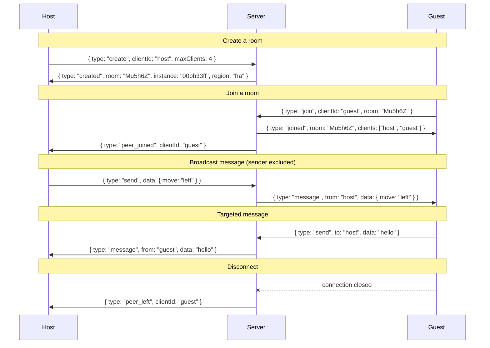

# Party-Sockets

Minimal WebSocket relay server for party games. Clients share rooms and exchange messages — the server just forwards them.

## How it works

- A client **creates** a room (server assigns a 6-char code) with a max client limit
- Other clients **join** by room code
- Clients provide their own UUID — reconnecting with the same UUID replaces the old connection
- Messages can be **broadcast** to all peers or **sent** to a specific client
- `peer_left` is broadcast immediately on disconnect
- Rooms are cleaned up when empty

## Run

```sh
bun run server.ts
# or
PORT=8080 bun run server.ts
```

## Usage

A host creates a room; one or more guests join it.

### Host

```js
const ws = new WebSocket("wss://your-relay.example.com");
const clientId = crypto.randomUUID(); // any stable string works — same clientId re-identifies a reconnect

ws.onopen = () => {
  ws.send(JSON.stringify({ type: "create", clientId, maxClients: 4 }));
};

ws.onerror = (event) => console.error("websocket error", event);

ws.onmessage = (event) => {
  const msg = JSON.parse(event.data);
  switch (msg.type) {
    case "created":     console.log("room code:", msg.room); break; // 6-char base58
    case "peer_joined": console.log("peer joined:", msg.clientId); break;
    case "peer_left":   console.log("peer left:", msg.clientId); break;
    case "message":     console.log("from", msg.from, msg.data); break;
    case "error":       console.error("server error:", msg.message); break;
  }
};
```

### Guest

```js
const ws = new WebSocket("wss://your-relay.example.com");
const clientId = crypto.randomUUID(); // any stable string works — same clientId re-identifies a reconnect

ws.onopen = () => {
  ws.send(JSON.stringify({ type: "join", clientId, room: "Mu5h6Z" }));
};

ws.onerror = (event) => console.error("websocket error", event);

ws.onmessage = (event) => {
  const msg = JSON.parse(event.data);
  // Guests also receive `peer_joined`, `peer_left`, `message`, and `error` —
  // see the host snippet above for the full event surface.
  if (msg.type === "joined") {
    // Broadcast to all peers. Add `to: "<peer-id>"` to target a single client.
    ws.send(JSON.stringify({ type: "send", data: { move: "left" } }));
  }
};
```

### Reconnect

Joining with the same `clientId` replaces the old connection — no special reconnect message needed. The server closes the previous WebSocket with code `4000` and reason `"replaced"`; treat that as terminal in your reconnect loop, otherwise the new connection will be torn down by the next replacement.

Hosts reconnect the same way as guests: send `join` with the original `clientId` and room code, not another `create`. Other peers are not notified — their existing peer state is unchanged.

```js
ws.onclose = (event) => {
  if (event.code === 4000) return; // replaced by a newer connection — don't reconnect
  // ...your reconnect logic
};
```

### Message flow



## Protocol reference

All messages are JSON over WebSocket.

### Client → Server

| type | fields | description |
|------|--------|-------------|
| `create` | `clientId`, `maxClients` | Create a new room. Server assigns the 6-char code. |
| `join` | `clientId`, `room` | Join an existing room |
| `send` | `data`, `to?` | Send to all peers or a specific client |

### Server → Client

| type | fields | description |
|------|--------|-------------|
| `created` | `room`, `instance`, `region` | Room created. `instance` identifies the holding machine for cross-instance routing; `region` is a label. |
| `joined` | `room`, `clients[]` | Joined room, list of current client IDs |
| `peer_joined` | `clientId` | A new peer joined the room |
| `peer_left` | `clientId` | A peer disconnected |
| `message` | `from`, `data` | Relayed message from a peer |
| `error` | `message` | Error description |

## Docker

```sh
docker build -t party-sockets .
docker run -p 3000:3000 -e PORT=3000 party-sockets
```

## Configuration

| variable | default | description |
|----------|---------|-------------|
| `PORT` | `3000` | TCP port to listen on |
| `INSTANCE_ID` | empty | Machine identifier echoed in the `created` message and `X-Instance-Id` response header |
| `REGION` | empty | Region label echoed in `created` and `/metrics` |
| `DASHBOARD_URL` | none | Where `GET /` redirects. Unset → plaintext `rooms` / `clients` snapshot |

## HTTP API

All HTTP endpoints include `Access-Control-Allow-Origin: *`.

### `GET /health`

Liveness probe.

- **200** — `{ status: "ok" }`

### `GET /room/:code`

Check whether a room exists on this server. The handling machine's ID is returned in the `X-Instance-Id` response header.

- **200** — room found: `{ clients: number, maxClients: number, origin: string }`
- **404** — room not found: `{ error: "Room not found" }`

### `GET /metrics`

Prometheus exposition format. Exposes:

- `party_sockets_clients` / `party_sockets_rooms` — live gauges
- `party_sockets_clients_by_origin` / `party_sockets_rooms_by_origin` — same, labeled by origin
- `party_sockets_connections_total` / `party_sockets_rooms_created_total` — since-boot counters per origin
- `party_sockets_origins_tracked` — origins currently tracked (size of internal map; capped at 500 with LRU eviction)
- `process_resident_memory_bytes`, `process_heap_used_bytes`, `process_uptime_seconds` — runtime health

All series are labeled with `instance`, `region`, `version`.

### `GET /` and any other path

**302** to `DASHBOARD_URL` if set; otherwise a plaintext `rooms` / `clients` snapshot for this machine.

## Dashboard

Starter Grafana dashboard at [`ops/grafana-dashboard.json`](ops/grafana-dashboard.json). Import into Grafana with a Prometheus datasource.

## Test

```sh
# Unit tests (in-process, no network)
bun test

# Live tests against a deployed instance
LIVE_URL=https://your-relay.example.com bun run test:live
```

## Fly deployment

On [Fly.io](https://fly.io) the platform-injected env vars unlock cross-instance and cross-region routing. None are required outside Fly.

| variable | role |
|----------|------|
| `FLY_APP_NAME` | Enables DNS-based peer probe and default `DASHBOARD_URL` |
| `FLY_MACHINE_ID` | Fallback for `INSTANCE_ID` |
| `FLY_REGION` | Fallback for `REGION`; enables region-encoded room codes |

### Multi-instance routing

When deployed across multiple machines behind one anycast hostname, the upgrade URL can carry routing hints so connections land on the machine that holds the room:

```js
// Pin to a known instance + room (from a previous `created` response)
new WebSocket("wss://your-relay.fly.dev/Mu5h6Z?instance=00bb33ff");

// Manual code entry: server reads /<code> from the path. Room codes encode
// their home region in the top 5 bits, so the receiving machine fly-replays
// directly to that region. Within the home region, peers probe each other
// over internal DNS to find the machine actually holding the room.
new WebSocket("wss://your-relay.fly.dev/Mu5h6Z");
```

Single-instance deployments can omit both — they're no-ops when no peers exist. Redirects use `fly-replay` headers; swap the helpers in `server.ts` for other platforms.

Stale `?instance=` values (machine replaced or destroyed) fall through to local handling rather than erroring — clients get a clean "Room not found" on join instead of a connection failure.

### Room code region encoding

When `FLY_REGION` is set, the top 5 bits of the room code encode the region index from `regions.ts`, so any peer can route a `/<code>` or `/room/<code>` request directly to the home region. Locally, the full 35-bit space is random and region routing is skipped.

### Dashboard default

When `FLY_APP_NAME` is set, `DASHBOARD_URL` defaults to Fly's hosted Grafana for the app.

### Live tests

`bun run test:live` pulls machine IDs from `flyctl` automatically (requires `fly` CLI and auth). Pass `LIVE_INSTANCES=id1,id2` to override. Multi-machine tests self-skip on single-machine deployments.
