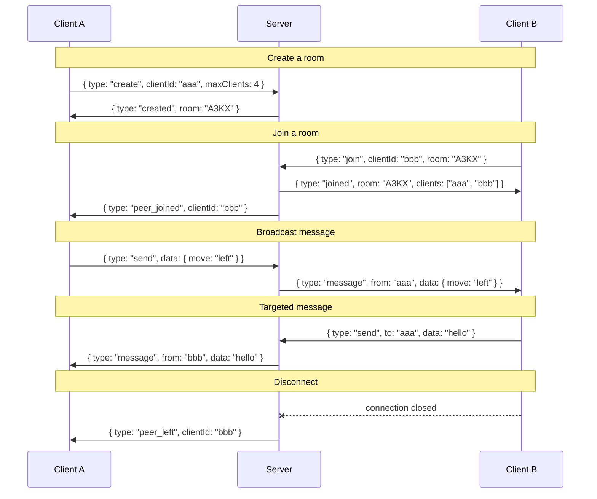

# Party-Sockets

Minimal WebSocket relay server for party games. Clients share rooms and exchange messages — the server just forwards them.

## How it works

- A client **creates** a room (server assigns a 4-char code, or uses a preferred code) with a max client limit
- Other clients **join** by room code
- Clients provide their own UUID — reconnecting with the same UUID replaces the old connection
- Messages can be **broadcast** to all peers or **sent** to a specific client
- `peer_left` is broadcast immediately on disconnect
- Rooms are cleaned up when empty

## Run

```sh
bun run server.ts
# or
PORT=8080 bun run server.ts
```

## Docker

```sh
docker build -t party-sockets .
docker run -p 3000:3000 party-sockets
```

## Usage

### Connect

```js
const ws = new WebSocket("wss://party-sockets.duckdns.org");
const clientId = crypto.randomUUID(); // any unique string works
```

### Create a room

```js
ws.send(JSON.stringify({ type: "create", clientId, maxClients: 4 }));

// Or request a specific room code (e.g. to restore a room after server restart)
ws.send(JSON.stringify({ type: "create", clientId, maxClients: 4, room: "A3KX" }));
```

If the preferred `room` code is a valid 4-letter code and not already taken, it will be used. Otherwise the server generates a new one.

### Join a room

```js
ws.send(JSON.stringify({ type: "join", clientId, room: "A3KX" }));
```

### Send messages

```js
// Broadcast to all peers
ws.send(JSON.stringify({ type: "send", data: { move: "left" } }));

// Send to a specific client
ws.send(JSON.stringify({ type: "send", to: "uuid-of-target", data: "hello" }));
```

### Handle events

```js
ws.onmessage = (event) => {
  const msg = JSON.parse(event.data);
  switch (msg.type) {
    case "created":     // room created, msg.room is the 4-char code
    case "joined":      // joined room, msg.clients is the list of client IDs
    case "peer_joined": // new peer, msg.clientId
    case "peer_left":   // peer disconnected, msg.clientId
    case "message":     // relayed message, msg.from + msg.data
    case "error":       // error, msg.message
  }
};
```

### Reconnect

Joining with the same `clientId` replaces the old connection — no special reconnect message needed.

### Message flow



## Protocol reference

All messages are JSON over WebSocket.

### Client → Server

| type | fields | description |
|------|--------|-------------|
| `create` | `clientId`, `maxClients`, `room?` | Create a new room (optionally with a preferred code) |
| `join` | `clientId`, `room` | Join an existing room |
| `send` | `data`, `to?` | Send to all peers or a specific client |

### Server → Client

| type | fields | description |
|------|--------|-------------|
| `created` | `room` | Room created successfully |
| `joined` | `room`, `clients[]` | Joined room, list of current client IDs |
| `peer_joined` | `clientId` | A new peer joined the room |
| `peer_left` | `clientId` | A peer disconnected |
| `message` | `from`, `data` | Relayed message from a peer |
| `error` | `message` | Error description |

## Test

```sh
bun test
```
