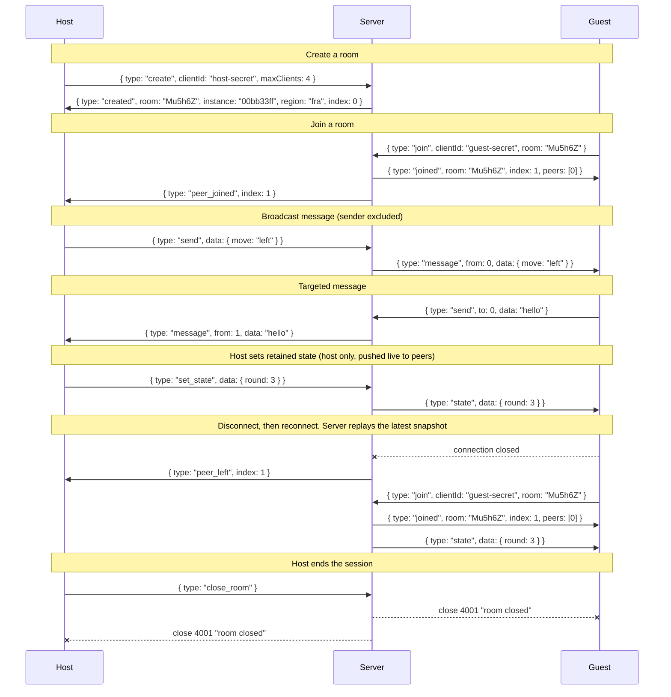

# Party-Sockets

Minimal WebSocket relay server for party games. Clients share rooms and exchange messages; the server just forwards them.

## How it works

- A client **creates** a room and gets a 6-char code plus a max client limit. Others **join** with the code.
- Each member gets a stable numeric `index` (slot id): `0` for the host, then `1`, `2`, and so on. Indices are never reassigned.
- Clients pick their own `clientId`. It stays server-side as the secret for their slot, so reconnecting with the same `clientId` resumes that slot.
- Messages are **broadcast** to every peer or **sent** to one peer by index.
- The host (slot `0`) can retain one **state** snapshot. The server replays it to any client on join or reconnect and pushes it live on every update. It lasts only as long as the room.
- Rooms are cleaned up when empty.

## Run

```sh
bun run server.ts
# or
PORT=8080 bun run server.ts
```

## Usage

A host creates a room; one or more guests join it.

### Host

```js
const ws = new WebSocket("wss://your-relay.example.com");
// Persist clientId in localStorage if you want reconnects to survive a reload.
const clientId = crypto.randomUUID();

ws.onopen = () => {
  ws.send(JSON.stringify({ type: "create", clientId, maxClients: 4 }));
};

ws.onerror = (event) => console.error("websocket error", event);

ws.onmessage = (event) => {
  const msg = JSON.parse(event.data);
  switch (msg.type) {
    case "created":     console.log("room code:", msg.room, "my index:", msg.index); break;
    case "peer_joined": console.log("peer joined:", msg.index); break;
    case "peer_left":   console.log("peer left:", msg.index); break;
    case "message":     console.log("from", msg.from, msg.data); break;
    case "state":       console.log("retained state:", msg.data); break;
    case "error":       console.error("server error:", msg.message); break;
  }
};

// As host you own the retained snapshot. Set it whenever shared state changes;
// reconnecting or late-joining guests get the latest copy automatically.
// ws.send(JSON.stringify({ type: "set_state", data: { round: 3, turn: 1 } }));
```

### Guest

```js
const ws = new WebSocket("wss://your-relay.example.com");
const clientId = crypto.randomUUID(); // presenting the same one re-identifies your slot

ws.onopen = () => {
  ws.send(JSON.stringify({ type: "join", clientId, room: "Mu5h6Z" }));
};

ws.onerror = (event) => console.error("websocket error", event);

ws.onmessage = (event) => {
  const msg = JSON.parse(event.data);
  // Guests also receive `peer_joined`, `peer_left`, `message`, and `error`.
  // See the host snippet above for the full event surface.
  if (msg.type === "joined") {
    // msg.index is your slot; msg.peers is everyone else's slots.
    // Broadcast to all peers. Add `to: <peerIndex>` to target a single peer.
    ws.send(JSON.stringify({ type: "send", data: { move: "left" } }));
  }
  if (msg.type === "state") {
    // The host's latest snapshot. Arrives right after `joined` on reconnect,
    // and again on every host update; apply it the same way both times.
    applyState(msg.data);
  }
};
```

### Reconnect

Joining with the same `clientId` replaces the old connection in the same slot; no special reconnect message needed. The server closes the previous WebSocket with code `4000` and reason `"replaced"`. Treat that as terminal in your reconnect loop, otherwise the new connection will be torn down by the next replacement.

Since the `clientId` stays on the original client, another connection can't *take over* your slot, but they can fill the cap spot it freed when you disconnected. Reconnect is best-effort: if the room re-filled while you were gone you'll get `Room is full`. Persist `clientId` locally if you want reconnect to survive a refresh.

Hosts reconnect like guests: send `join` with the original `clientId` and room code, not another `create`.

On a successful (re)join the server replays the host's latest retained snapshot as a `state` message right after `joined`, so a peer that dropped briefly catches up without the host re-sending anything. The snapshot only survives while the room does. If every member disconnects, the room (and its snapshot) is cleaned up.

```js
ws.onclose = (event) => {
  if (event.code === 4000) return; // replaced by a newer connection; don't reconnect
  if (event.code === 4001) return; // room closed; don't reconnect
  // ...your reconnect logic
};
```

### Room lifetime

A room ends in one of three ways, and in every case `GET /room/:code` starts returning **404** immediately, so stale join links stop resolving:

- **The host closes it.** The host sends `close_room`; every member (the host included) receives WebSocket close `4001` / `"room closed"`.
- **The host stays gone.** If the host's socket drops and no connection reclaims slot `0` within **2 minutes**, the room is torn down and remaining members get the same `4001` close. Within the window the room stays fully live, so a rebooting host device picks up right where it left off.
- **Everyone leaves.** A room with no connected members is deleted at once.

Treat `4001` as terminal: the room is gone, so surface "game over / room closed" to the player instead of reconnecting.

### Message flow



## Protocol reference

All messages are JSON over WebSocket.

### Client → Server

| type | fields | description |
|------|--------|-------------|
| `create` | `clientId`, `maxClients`, `url?` | Create a new room. Server assigns the 6-char code. Keep `clientId` private; presenting it again reclaims the slot. `url` is an optional controller-URL template, see [Controller URL](#controller-url). |
| `join` | `clientId`, `room` | Join an existing room. Reusing your prior `clientId` reclaims your slot. |
| `send` | `data`, `to?` | Send to all peers or a specific peer (`to` is a numeric index). |
| `set_state` | `data` | **Host only** (slot `0`). Retain a single state snapshot, replayed to clients on join/reconnect and pushed live to current peers. `data` is required; `null` is retained and replayed as `null` (a cleared-state signal), not removed. Capped at 16 KiB (UTF-8 bytes of the serialized payload). |
| `close_room` | — | **Host only** (slot `0`). Delete the room and close every member's socket with code `4001` / `"room closed"`. No ack message; the sender's own `4001` close frame is the confirmation. |

### Server → Client

| type | fields | description |
|------|--------|-------------|
| `created` | `room`, `instance`, `region`, `index`, `url?` | Room created. `index` is your slot id (always `0` for the creator). `instance` identifies the holding machine for cross-instance routing; `region` is a label. `url` appears only if the host passed a template on `create`, filled in for this room. |
| `joined` | `room`, `index`, `peers[]`, `url?` | Joined room. `index` is your slot id; `peers` lists the other present slot ids. `url` is the resolved controller URL, present only if the host set a template. |
| `peer_joined` | `index` | A new peer joined the room |
| `peer_left` | `index` | A peer disconnected |
| `message` | `from`, `data` | Relayed message from a peer (`from` is the sender's index) |
| `state` | `data` | The host's retained snapshot, sent right after `joined` on (re)join, and on each host update. |
| `error` | `message` | Error description |

## Controller URL

A generic controller (say a native app where the player types the room code) needs to know *what to load* for a room. The host declares a `url` template on `create`, and the relay returns it resolved in `created`, every `joined`, and `GET /room/:code`, so a client holding only the code can find the page:

```js
ws.send(JSON.stringify({
  type: "create", clientId, maxClients: 4,
  url: "https://play.example.com/{room}?instance={instance}",
}));
// resolves to e.g. "https://play.example.com/Mu5h6Z?instance=00bb33ff"
```

`{room}` fills in the code and `{instance}` the holding machine (for pinned reconnects); the host cannot supply these itself, since neither exists until create. The template must be an absolute `https:` URL, at most 512 bytes, free of spaces and control characters, with balanced braces and no other placeholders. Keep `{instance}` in the path or query, not the host, since it is empty on non-Fly single-instance deployments.

## Docker

```sh
docker build -t party-sockets .
docker run -p 3000:3000 -e PORT=3000 party-sockets
```

## Configuration

| variable | default | description |
|----------|---------|-------------|
| `PORT` | `3000` | TCP port to listen on |
| `INSTANCE_ID` | empty | Machine identifier echoed in the `created` message and `X-Instance-Id` response header |
| `REGION` | empty | Region label echoed in `created` and `/metrics` |
| `DASHBOARD_URL` | none | Where `GET /` redirects. Unset → plaintext `rooms` / `clients` snapshot |

## HTTP API

All HTTP endpoints include `Access-Control-Allow-Origin: *`.

### `GET /health`

Liveness probe.

- **200**: `{ status: "ok" }`

### `GET /room/:code`

Check whether a room exists on this server. The handling machine's ID is returned in the `X-Instance-Id` response header.

- **200**, room found: `{ clients: number, maxClients: number, origin: string, url?: string }`
- **404**, room not found: `{ error: "Room not found" }`

`url` is present only when the host declared a controller-URL template on `create`; it comes back with `{room}`/`{instance}` filled in for this room. See [Controller URL](#controller-url).

### `GET /metrics`

Prometheus exposition format. Exposes:

- `party_sockets_clients` / `party_sockets_rooms`: live gauges
- `party_sockets_clients_by_origin` / `party_sockets_rooms_by_origin`: same, labeled by origin
- `party_sockets_connections_total` / `party_sockets_rooms_created_total`: since-boot counters per origin
- `party_sockets_origins_tracked`: origins currently tracked (size of internal map; capped at 500 with LRU eviction)
- `process_resident_memory_bytes`, `process_heap_used_bytes`, `process_uptime_seconds`: runtime health

All series are labeled with `instance`, `region`, `version`.

### `GET /` and any other path

**302** to `DASHBOARD_URL` if set; otherwise a plaintext `rooms` / `clients` snapshot for this machine.

## Dashboard

Starter Grafana dashboard at [`ops/grafana-dashboard.json`](ops/grafana-dashboard.json). Import into Grafana with a Prometheus datasource.

## Test

```sh
# Unit tests (in-process, no network)
bun test

# Live tests against a deployed instance
LIVE_URL=https://your-relay.example.com bun run test:live
```

## Fly deployment

On [Fly.io](https://fly.io) the platform-injected env vars unlock cross-instance and cross-region routing. None are required outside Fly.

| variable | role |
|----------|------|
| `FLY_APP_NAME` | Enables DNS-based peer probe and default `DASHBOARD_URL` |
| `FLY_MACHINE_ID` | Fallback for `INSTANCE_ID` |
| `FLY_REGION` | Fallback for `REGION`; enables region-encoded room codes |

### Multi-instance routing

When deployed across multiple machines behind one anycast hostname, the upgrade URL can carry routing hints so connections land on the machine that holds the room:

```js
// Pin to a known instance + room (from a previous `created` response)
new WebSocket("wss://your-relay.fly.dev/Mu5h6Z?instance=00bb33ff");

// Manual code entry: server reads /<code> from the path. Room codes encode
// their home region in the top 5 bits, so the receiving machine fly-replays
// directly to that region. Within the home region, peers probe each other
// over internal DNS to find the machine actually holding the room.
new WebSocket("wss://your-relay.fly.dev/Mu5h6Z");
```

Single-instance deployments can omit both; they're no-ops when no peers exist. Redirects use `fly-replay` headers; swap the helpers in `server.ts` for other platforms.

Stale `?instance=` values (machine replaced or destroyed) fall through to local handling rather than erroring; clients get a clean "Room not found" on join instead of a connection failure.

### Room code region encoding

When `FLY_REGION` is set, the top 5 bits of the room code encode the region index from `regions.ts`, so any peer can route a `/<code>` or `/room/<code>` request directly to the home region. Locally, the full 35-bit space is random and region routing is skipped.

### Dashboard default

When `FLY_APP_NAME` is set, `DASHBOARD_URL` defaults to Fly's hosted Grafana for the app.

### Live tests

`bun run test:live` pulls machine IDs from `flyctl` automatically (requires `fly` CLI and auth). Pass `LIVE_INSTANCES=id1,id2` to override. Multi-machine tests self-skip on single-machine deployments.
