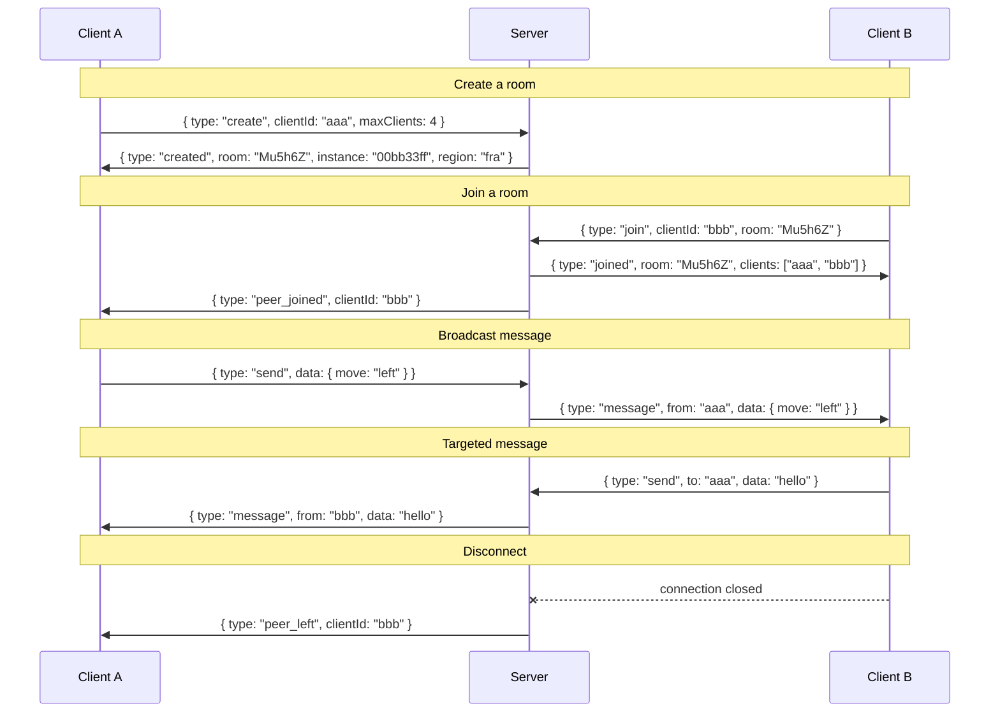

# Party-Sockets

Minimal WebSocket relay server for party games. Clients share rooms and exchange messages — the server just forwards them.

## How it works

- A client **creates** a room (server assigns a 6-char code) with a max client limit
- Other clients **join** by room code
- Clients provide their own UUID — reconnecting with the same UUID replaces the old connection
- Messages can be **broadcast** to all peers or **sent** to a specific client
- `peer_left` is broadcast immediately on disconnect
- Rooms are cleaned up when empty

## Run

```sh
bun run server.ts
# or
PORT=8080 bun run server.ts
```

## Docker

```sh
docker build -t party-sockets .
docker run -p 3000:3000 -e PORT=3000 party-sockets
```

## Usage

### Connect

```js
const ws = new WebSocket("wss://your-relay.fly.dev");
const clientId = crypto.randomUUID(); // any unique string works
```

### Multi-instance routing (optional)

When deployed across multiple instances behind a single anycast hostname, the upgrade URL can carry routing hints so connections land on the machine that actually holds the room:

```js
// Pin to a known instance (from a previous `created` response)
new WebSocket("wss://your-relay.fly.dev/?instance=00bb33ff");

// Manual code entry: server reads /<code> from the path. Room codes encode
// their home region in the top 5 bits, so the receiving machine fly-replays
// directly to that region — no peer probe needed. Legacy codes fall back
// to a peer probe via internal DNS.
new WebSocket("wss://your-relay.fly.dev/Mu5h6Z");
```

Single-instance deployments can omit both — they're no-ops when no peers exist. Redirects are emitted as `fly-replay` headers by default; swap the `flyReplayToInstance` / `flyReplayToRegion` helpers in `server.ts` to target a different platform.

Stale `?instance=` values (machine replaced or destroyed) fall through to local handling rather than erroring — clients get a clean "Room not found" on join instead of a connection failure.

### Room code format

Server-generated codes are 6-char base58 (Bitcoin alphabet — no `0`, `O`, `I`, `l`). When `FLY_REGION` is set, the top 5 bits encode the region index from `regions.ts`, allowing any peer to route a `/<code>` or `/room/<code>` request directly to the home region without DNS probing. Locally, the full 35-bit space is random and region routing is skipped.

### Create a room

```js
ws.send(JSON.stringify({ type: "create", clientId, maxClients: 4 }));
```

The server picks the room code. The code is returned in the `created` response.

### Join a room

```js
ws.send(JSON.stringify({ type: "join", clientId, room: "Mu5h6Z" }));
```

### Send messages

```js
// Broadcast to all peers
ws.send(JSON.stringify({ type: "send", data: { move: "left" } }));

// Send to a specific client
ws.send(JSON.stringify({ type: "send", to: "uuid-of-target", data: "hello" }));
```

### Handle events

```js
ws.onmessage = (event) => {
  const msg = JSON.parse(event.data);
  switch (msg.type) {
    case "created":     // room created, msg.room is the room code
    case "joined":      // joined room, msg.clients is the list of client IDs
    case "peer_joined": // new peer, msg.clientId
    case "peer_left":   // peer disconnected, msg.clientId
    case "message":     // relayed message, msg.from + msg.data
    case "error":       // error, msg.message
  }
};
```

### Reconnect

Joining with the same `clientId` replaces the old connection — no special reconnect message needed. The old WebSocket is closed by the server with code `4000` and reason `"replaced"`, so if you're managing a reconnect loop, treat that close as terminal rather than retrying.

```js
ws.onclose = (event) => {
  if (event.code === 4000) return; // replaced by a newer connection, don't reconnect
  // ...your reconnect logic
};
```

### Message flow



## HTTP API

All HTTP endpoints include `Access-Control-Allow-Origin: *`.

### `GET /health`

Liveness probe.

- **200** — `{ status: "ok" }`

### `GET /room/:code`

Check whether a room exists on the receiving machine. Used by the peer probe to find which sibling holds a manually-typed room code.

- **200** — room found: `{ clients: number, maxClients: number, origin: string }`
- **404** — room not found: `{ error: "Room not found" }`

### `GET /metrics`

Prometheus exposition format. Auto-scraped by Fly every 15s and visible in the hosted Grafana at [fly-metrics.net](https://fly-metrics.net/). Exposes:

- `party_sockets_clients` / `party_sockets_rooms` — live gauges
- `party_sockets_clients_by_origin` / `party_sockets_rooms_by_origin` — same, labeled by origin
- `party_sockets_connections_total` / `party_sockets_rooms_created_total` — since-boot counters per origin
- `party_sockets_origins_tracked` — distinct origins seen since boot (size of internal map)
- `process_resident_memory_bytes`, `process_heap_used_bytes`, `process_uptime_seconds` — runtime health

All series are labeled with `instance`, `region`, `version`.

### `GET /` and any other path

Browsers hitting unknown paths get a **302** to the Grafana dashboard (`DASHBOARD_URL`, defaulting to Fly's hosted dashboard). The relay has no UI of its own — observability lives in Grafana.

## Dashboard

A starter Grafana dashboard lives at [`ops/grafana-dashboard.json`](ops/grafana-dashboard.json). Import it from [fly-metrics.net](https://fly-metrics.net/) → **Dashboards** → **New** → **Import** → paste the JSON. Pick the Fly Prometheus datasource when prompted. Panels: cluster live counts, RSS/heap per machine (with 200 MiB threshold line for the 256 MB VM), connection/room rate, top origins, uptime.

## Protocol reference

All messages are JSON over WebSocket.

### Client → Server

| type | fields | description |
|------|--------|-------------|
| `create` | `clientId`, `maxClients` | Create a new room. Server assigns the 6-char code. |
| `join` | `clientId`, `room` | Join an existing room |
| `send` | `data`, `to?` | Send to all peers or a specific client |

### Server → Client

| type | fields | description |
|------|--------|-------------|
| `created` | `room`, `instance`, `region` | Room created. `instance` identifies the holding machine for cross-instance routing; `region` is a label. |
| `joined` | `room`, `clients[]` | Joined room, list of current client IDs |
| `peer_joined` | `clientId` | A new peer joined the room |
| `peer_left` | `clientId` | A peer disconnected |
| `message` | `from`, `data` | Relayed message from a peer |
| `error` | `message` | Error description |

## Test

```sh
# Unit tests (in-process, no network)
bun test

# Live tests against a deployed instance
LIVE_URL=https://ws.hexstacker.com bun run test:live
```

Live tests pull machine IDs from `flyctl` automatically (requires `fly` CLI and auth). Pass `LIVE_INSTANCES=id1,id2` to override. Multi-machine tests self-skip on single-machine deployments.
